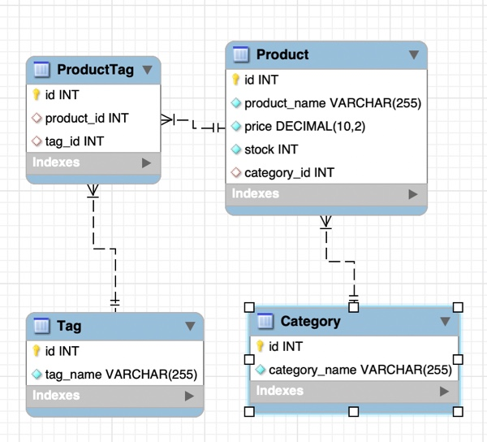

# e-commerce-back-end
## Description
Create a back end for an e-commerce site. This program is using Express.js API to use Sequelize to interact with a MySQL database.

Repository: 
    https://github.com/mingmanhk/e-commerce-back-end
     
Category

Product

Tag

## Table of Contents
1. [Installation](#installation)

2. [Usage](#usage)

3. [Credits](#credits)

4. [License](#license)

5. [Features](#features)

6. [Contribute](#contribute)

7. [Test](#test)

8. [Questions](#questions)

## Installation
    1. Run npm install to install all dependencies
    2. Run schema.sql in MySQLWorkbench to create database schema
    3. Run seeds.sql in MySQLWorkbench to add sample data

## Usage
   1. Open terminal
   2. Run 'npm start'
   3. Open Insomnia application
   4. using api route /api/products, /api/categories and /api/tags to interact with backend database
   
   
   
## Credits
Victor Lam

## License

## Features
This application provided following functionality:

    * Get All Categories, Get one Category, Update Category, Delete Category
    * Get All Products, Get one Product, Update Product, Delete Product
    * Get All Tags, Get one Tag, Update Tag, Delete Tag

Additional feature:

    * Using Async to queries sql data

## Contribute
Victor Lam

## Questions
Questions about this repository? Please contact me at [mingmanhk@gmail.com](mailto:mingmanhk@gmail.com).
View more of my work in GitHub at [mingmanhk](https://github.com/mingmanhk)